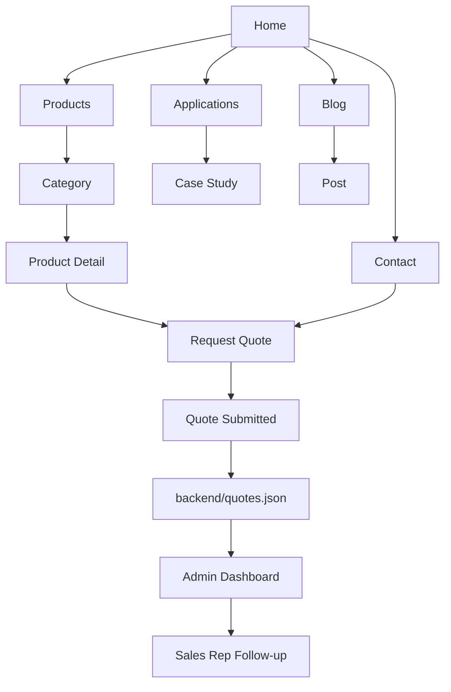

# Quote Spec & Website Flow — Techwin

Purpose: A single reference file for client demos describing sitemap, page-level features, routing, and the `Request Quote` form schema. Includes a flowchart you can show to stakeholders.

---

## 1) Quick links

- Contact page (with Quote form): [src/app/contact/page.tsx](src/app/contact/page.tsx)
- Quote form component: [src/components/QuoteForm.tsx](src/components/QuoteForm.tsx)
- Quote API route: [src/app/api/quote/route.ts](src/app/api/quote/route.ts)
- Saved submissions (backend): `backend/quotes.json`

---

## 2) Sitemap (primary pages)

- `/` — Home: Hero, product highlights, applications, testimonials, CTA
- `/products` — Products overview (categories)
- `/products/[category]` — Category listing
- `/products/[category]/[slug]` — Product detail + datasheet + Request Quote CTA
- `/applications` — Applications & case studies
- `/about` — Company, certifications, timeline
- `/blog` — Posts and resources
- `/contact` — Contact form + Request Quote embedded
- `/request-quote` (optional) — Dedicated quote page (can be same as `/contact`)
- `/search` — Search UI
- `/admin` — Admin dashboard (private)

API endpoints (Next.js app router style):
- `POST /api/quote` — Save incoming quote requests to `backend/quotes.json` (already implemented)
- `POST /api/contact` — Contact form handling (existing)
- `GET  /api/admin/quotes` — (optional) list saved quotes for admin UI

---

## 3) Visual flow (Mermaid)



Show this Mermaid block during client presentations (GitHub and many MD viewers render it). If embedding in a slide, export as PNG from Mermaid live editor.

---

## 4) Routing & feature map (Next.js app router)

- `src/app/page.tsx` — `/` (Home)
  - Feature: Hero, product highlights, primary CTA -> `/products`

- `src/app/products/page.tsx` — `/products`
  - Feature: Category tiles, filters (wavelength, power, application)

- `src/app/products/[category]/page.tsx` — `/products/[category]`
  - Feature: category overview, product list, quick filters

- `src/app/products/[category]/[slug]/page.tsx` — product page
  - Feature: Key specs, datasheet download, product images, `Request Quote` CTA

- `src/app/contact/page.tsx` — `/contact` (modified)
  - Feature: Contact form + embedded `Request Quote` form (`src/components/QuoteForm.tsx`)

- `src/app/api/quote/route.ts` — API
  - Behaviour: Accept JSON POST, append item to `backend/quotes.json`, return {success:true}

- `src/app/admin/*` — Admin UI (protected)
  - Feature ideas: list leads, filter by status, assign rep, export CSV

Routing notes:
- Keep `Request Quote` accessible from product pages and from the persistent header CTA.
- Optionally create `GET /api/admin/quotes` that returns the JSON for a simple admin table.

---

## 5) `Request Quote` form schema (JSON)

```json
{
  "title": "Request Quote",
  "fields": [
    {"name":"fullName","type":"text","label":"Full name","required":true},
    {"name":"company","type":"text","label":"Company","required":true},
    {"name":"email","type":"email","label":"Email","required":true},
    {"name":"phone","type":"tel","label":"Phone","required":false},
    {"name":"productModel","type":"text","label":"Product model / SKU","required":false},
    {"name":"requiredPower","type":"text","label":"Required output power","required":false},
    {"name":"wavelength","type":"text","label":"Wavelength / spectral needs","required":false},
    {"name":"application","type":"textarea","label":"Application / brief description","required":true},
    {"name":"timeline","type":"select","label":"Timeline","required":true,"options":["ASAP","1-4 weeks","1-3 months","3+ months"]},
    {"name":"preferredContact","type":"select","label":"Preferred contact","required":false,"options":["Email","Phone","Video call"]}
  ],
  "successMessage":"Thanks — your request has been received. Our team will respond within 1 business day."
}
```

Validation & microcopy:
- Required fields: `fullName`, `company`, `email`, `application`.
- Submit button text: `Request Quote`.
- Success: `Thanks — your request has been received. We will respond within 1 business day.`

---

## 6) Admin & follow-up workflow

1. Submission saved to `backend/quotes.json` with fields + `id` + `createdAt`.
2. (Optional) Send notification email to sales: Subject `New Quote Request — [productModel] — [company]`.
3. Sales rep assigns lead status in admin UI: `new, contacted, quoted, closed`.
4. Export leads to CSV or integrate with CRM later.

Admin API suggestions:
- `GET /api/admin/quotes` — list (protected)
- `POST /api/admin/quotes/:id/status` — update status (protected)

---

## 7) Assets & filenames

- Hero: `public/hero-home.jpg`
- Category thumbs: `public/images/categories/*.jpg`
- Product images: `public/products/product-[model].jpg`
- Datasheets: `public/datasheets/datasheet-[model].pdf`

Storage: put static files in `public/` so they are served directly by Next.js.

---

## 8) How to demo to a client (quick script)

1. Start dev server:

```bash
npm install
npm run dev
```

2. Open `http://localhost:3000` — show Home -> Products -> Product Detail.
3. Click `Request Quote` on a product page (or go to `/contact`) and submit a sample quote.
4. Show `backend/quotes.json` file update or open the simple admin page (if implemented).
5. To share files with client: create a ZIP of the three key files and assets or provide links in the repo:
   - [src/app/contact/page.tsx](src/app/contact/page.tsx)
   - [src/components/QuoteForm.tsx](src/components/QuoteForm.tsx)
   - [src/app/api/quote/route.ts](src/app/api/quote/route.ts)

To create a zip (local):

```bash
cd /path/to/techwin
zip -r techwin-quote-demo.zip src/app/contact/page.tsx src/components/QuoteForm.tsx src/app/api/quote/route.ts backend/quotes.json
```

---

## 9) Next recommended steps (pick one)

- Add `GET /api/admin/quotes` and a minimal `src/app/admin/quotes/page.tsx` list view (I can scaffold this).
- Add SMTP email notification on submit (use `nodemailer` or external provider like SendGrid).
- Export the Mermaid flow to PNG for slides.

---

If you want, I can now scaffold the admin quotes list page and the `GET /api/admin/quotes` route and then show a short demo script. Otherwise, this `quote-spec.md` is ready to share with the client.
